# 10 Spark Anti-Patterns That Kill Performance (And How to Fix Them)

## Contributiors:

## Introduction
If you've spent any real time running Spark jobs in production, you've hit at least one of these walls: a job that silently balloons from 10 minutes to 4 hours, a driver that OOMs for no obvious reason, or a single task that runs 100x longer than every other task in its stage. These aren't bad luck - they're almost always the result of a handful of recurring anti-patterns.

Spark's Catalyst optimizer and Adaptive Query Execution (AQE) work hard to prevent exactly this, planning efficient execution up front and adjusting on the fly using real runtime stats. But they can only work with what you give them - hide your pipeline behind unnecessary disk writes or bury a filter after a join, and you take away the information they need to build a smart plan.

This article walks through 10 practices that consistently separate Spark jobs that scale from Spark jobs that fall over. Each one comes with a "before" (the anti-pattern) and "after" (the fix), because it's easier to internalize why something matters when you can see the shape of the mistake.

## 1. Column Pruning & Predicate Pushdown
If you filter rows or select columns after a join, Spark has already shuffled the full, unfiltered dataset across the network before doing any of that trimming. All that wasted movement could have been avoided.

Spark can push filters and column selections down into the file scan itself - but only if it can see that opportunity before the data gets tangled up in a join or an expensive per-row computation (like a UDF). Filtering after the join or UDF is too late.

### Example

**Before, filter/select after the join:**
```python
df = claims_df.withColumn(
    "claim_category",
    categorize_claim_udf(F.col("claim_amount"))
)

result = (
    df
    .filter(F.col("claim_amount") > 100 & F.col("claim_amount").isNotNull())
    .select("claim_id", "claim_amount", "claim_category")
)
```

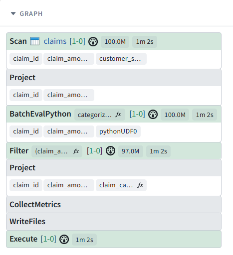<br>

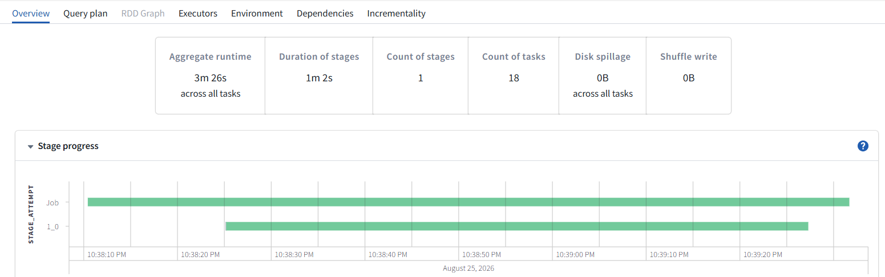<br>

**Problem -** Full datasets loaded into memory, all rows carried through the join causing unnecessary memory overhead & I/O

**Impact -** Null `claim_amount` rows (CLM005, CLM009) participate in the join before being dropped and wasted compute resources moving columns nobody asked for

**After, prune unused columns and filter early:**
```python
df = claims_df.withColumn(
        "claim_category",
        categorize_claim_udf(F.col("claim_amount"))
    )

result = (
    df
    .filter(F.col("claim_amount") > 100 & F.col("claim_amount").isNotNull())
    .select("claim_id", "claim_amount", "claim_category")
)
```

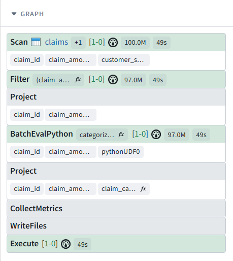<br>

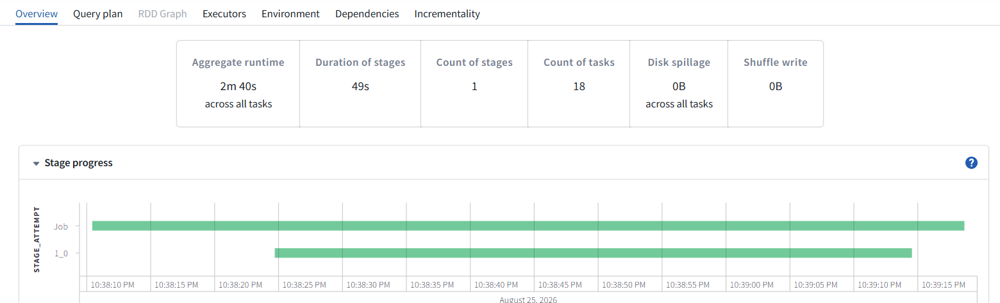<br>

**Benefits -** Drastically reduced memory footprint and nulls never the join at all

> **Pro Tip:** *Spark's Catalyst optimizer pushes filters and column selections down to the file scan automatically - but only when it can prove doing so is safe. The moment a UDF, an outer join, or a non-deterministic expression is involved, that guarantee disappears. Making a habit of writing filters and select() statements before a join or UDF, rather than relying on Catalyst to rearrange them, keeps performance consistent and predictable across production pipelines - same result, far less data shuffled.*

## 2. Avoid Cross Join Unless One Side Is Tiny
A cross join pairs every row on one side with every row on the other. In production, matching every claim against every hospital record - even though you only wanted hospitals in the same state - could mean millions of unnecessary row combinations. Without an actual join key, Spark can't use efficient join strategies (like sort-merge join); it's forced to compute every possible pairing, which grows explosively as data volume grows.

### Example

**Before:**
```python
result = claims_df.crossJoin(hospitals_df) \
    .filter(claims_df.state == hospitals_df.hospital_state) \
    .filter(hospitals_df.hospital_active == True)
```
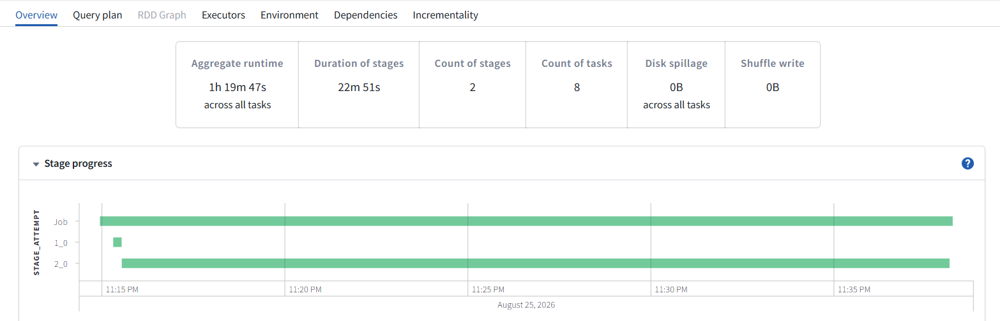<br>

**Problem -** Every claim gets paired with every hospital before any filtering happens. With no join key, Spark can't use an efficient join strategy - it's forced into a brute-force nested loop. The filter condition (state == state) reveals there was a real join key all along; it just got applied too late.

**Impact -** Row count explodes before the filter can discard most of it - with 15 claims × 6 hospitals that's only 90 rows here, but at production scale (millions of claims × thousands of hospitals), this becomes untenable. Massive shuffle and compute get spent building rows that never survive the filter, creating a high risk of executor OOM or a stage that never finishes as data volumes grow.

**After:**
```python
active_hospitals = hospitals_df.filter(hospitals_df.active == True) \
    .dropDuplicates(["state", "hospital_id"])

result = claims_df.join(
    active_hospitals,
    claims_df.state == active_hospitals.state,
    "inner"
)
```

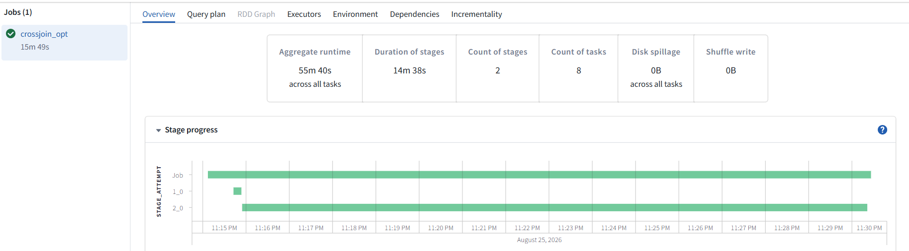<br>

**Benefits -** With a real join key in place, Spark can choose an efficient strategy - sort-merge or broadcast join - instead of brute-forcing every pairing, keeping row count proportional to matching keys rather than the full cross product. Filtering out the inactive hospital (H004) beforehand shrinks the build side further, reducing both shuffle volume and memory pressure.

> **Pro Tip:** *If you're filtering right after a crossJoin, that filter condition is almost always meant to be your join key. Use join() with a real condition instead.*

## 3. Aggregate or Deduplicate Before Joining
If your end goal is a summary (a sum, a count, an average) or a clean one-row-per-key dataset, joining the raw/duplicate-laden data first and cleaning up after means the join processes every single row - even though most of that detail or duplication gets thrown away moments later. The cost of a join scales with how many rows go into it. Summarizing or deduplicating first shrinks the data before the expensive part even starts.

### Part A: Aggregate Before Joining

**Before:**
```python
result = (
    claims_df.join(customers_df, "customer_id")
    .groupBy("customer_id")
    .agg(F.sum("claim_amount").alias("total_claims"))
)
```
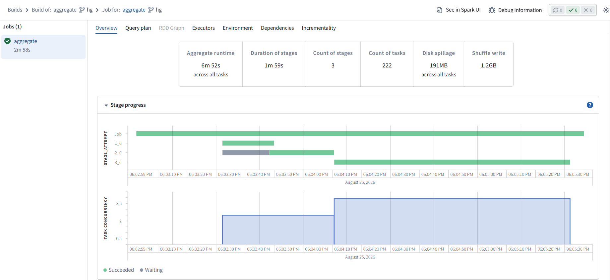<br>

**Problem -** The join runs on every raw claim row instead of the final summarized rows, and unnecessary customer columns participate in the join, adding memory pressure and shuffle overhead.

**Impact -** Shuffle scales with total claims (15 rows here, millions in production) instead of distinct customers (10 rows here), wasting compute on joining detail that gets discarded right after.

**After:**
```python
agg_claims = claims_df.groupBy("customer_id") \
    .agg(F.sum("claim_amount").alias("total_claims"))

result = agg_claims.join(customers_df, "customer_id")
```

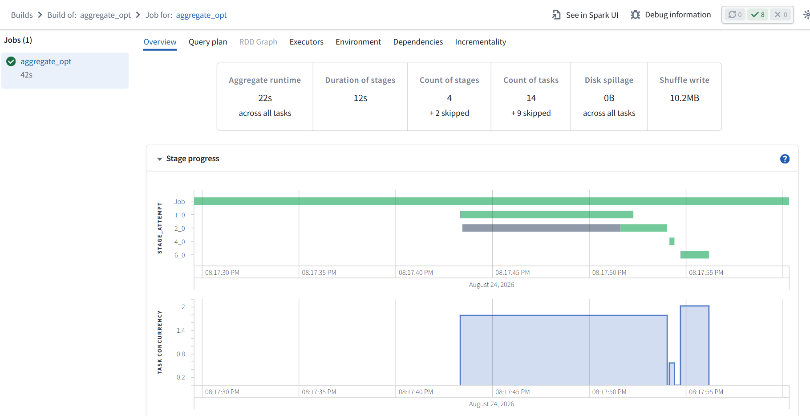<br>

**Benefits -** The join now operates on far fewer rows - one per customer, not one per claim - resulting in a smaller shuffle, less memory pressure, and faster runtime. The result stays the same, since aggregation and join order don't change correctness here.

### Part B: Deduplicate Before Joining
Duplicates are just as costly as unaggregated details - a customer record ingested twice by an upstream system causes a fan-out on every join, multiplying rows that get discarded moments later anyway.

**Before, deduplicating after the join:**
```python
# customers_df has duplicate rows for C003 (ingested twice upstream)
result = claims_df.join(customers_df, "customer_id") \
    .dropDuplicates(["claim_id"])
```

**Problem -** 
- The join runs against every duplicate customer row, not just distinct ones
- Each duplicate on the `customers_df` side fans out - one claim can multiply into 2, 3, or more rows before `dropDuplicates` cleans it up
- Spark has to shuffle and materialize the bloated, duplicated result before it can even start deduplicating

**Impact -**
- If C003 has 2 duplicate rows, every one of C003's claims gets doubled in the join output - pure noise thrown away right after
- Wasted shuffle, memory, and compute spent building rows that never survive the final `dropDuplicates`
- At production scale, even a 1–2% duplicate rate on a dimension table can meaningfully inflate shuffle volume

**After, deduplicate before the join:**
```python
customers_dedup = customers_df.dropDuplicates(["customer_id"])
result = claims_df.join(customers_dedup, "customer_id")
```

**Benefits -**
- The join sees exactly one row per customer - no fan-out, no bloated intermediate result
- `dropDuplicates` runs on the smaller, pre-join table instead of the multiplied post-join output
- Same result, but the join itself does far less work


> **Pro Tip:** *If you're aggregating or deduplicating right after a join, ask whether you can do it before instead - the results are identical, but the join has far less work to do either way. Summarize and clean up your data first, let the join operate on the smallest, truest version of each side.*

## 4. Broadcast Only Genuinely Small Tables
A broadcast join sends a full copy of one table to every machine in the cluster, avoiding a shuffle entirely. This is a great trick - but only if the table is small. Broadcasting a multi-gigabyte table can crash every executor at once.

Broadcasting relies on the table fitting comfortably in memory on every executor. If it doesn't, you get out-of-memory errors that can be confusing to diagnose because they don't look like a "size" problem at first glance.

### Example

**Before, all joins treated as sort-merge joins:**
```python
# All joins are sort-merge - full shuffle on both sides
df = claims_df.join(customers_df, "customer_id", "inner") \
    .join(policies_df, "policy_id", "inner") \
    .join(hospitals_df, "hospital_id", "inner") \
    .join(payments_df, "claim_id", "left")
```
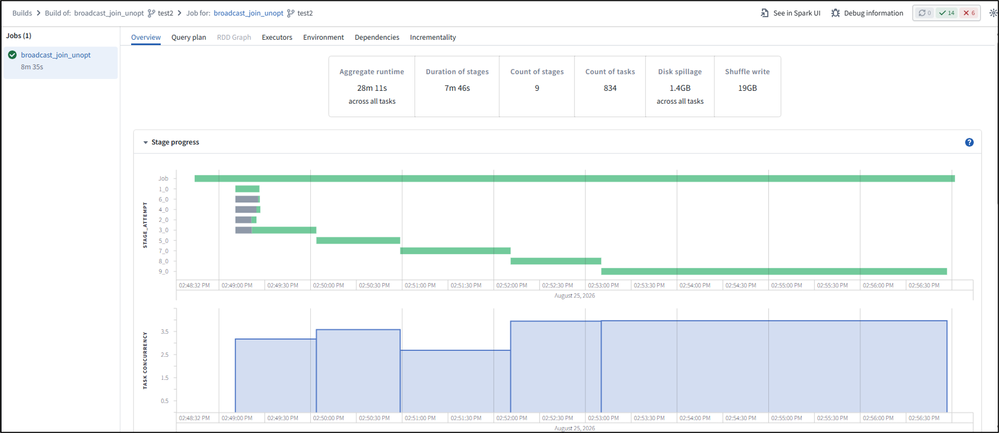<br>

**Problem -**
- Small, static dimension tables (`customers_df`, `policies_df`, `hospitals_df` - each just 6-10 rows here, but small relative to claims even at production scale) get shuffled every time, even though they rarely change and are tiny compared to claims

**Impact -**
- Unnecessary shuffle cost on every join stage
- Slower runtime than needed, since Spark could have skipped the shuffle entirely for the small side

**After, broadcast small dimension tables:**
```python
from pyspark.sql.functions import broadcast

base_df = (
    claims_df
  . join(broadcast(customers_df), "customer_id", "inner")
  . join(broadcast(policies_df), "policy_id", "inner")
  . join(broadcast(hospitals_df), "hospital_id", "inner")
  .join (payments_df, "claim_id", "left")  # only this one shuffles
)
```
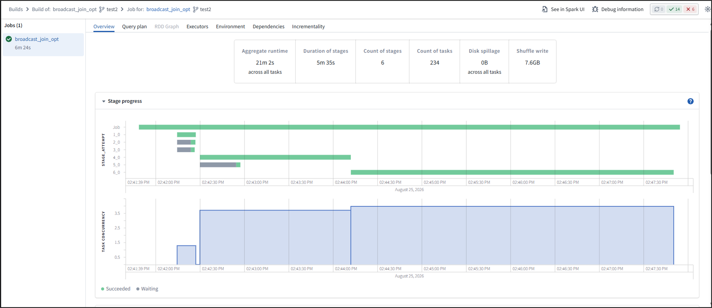<br>

**Benefits -**
- No shuffle needed for the broadcast tables - huge speedup on those joins
- `claims_df` (the large side) never needs to move, only the small tables are copied out
- Leaves `payments_df` as the only real shuffle, since not every claim has a payment yet and it's not a good broadcast candidate at scale

> **Pro Tip:** *If you're not 100% sure a table is small, don't force a broadcast - let Spark's built-in threshold and AQE make that call for you based on real data size.*

## 5. Detect & Fix Skewed Join Keys
Sometimes one value in your join key - a specific customer, or a "null"/"unknown" placeholder - has way more rows than everything else combined. In our dataset, `customer_id = "C001"` accounts for 6 of the 15 claims. At production scale, imagine one customer (or a data quality "unknown" bucket) accounting for millions of rows while everyone else has a handful - one task ends up doing the bulk of the work while all other tasks finish and sit idle.

Spark distributes join work by hashing the key and assigning rows to partitions. If one key value dominates, its partition becomes enormous, and the stage can't finish until that one slow task finishes.

### Example

**Before, no skew handling:**
```python
# No skew handling - hot keys overload single executors
result = claims_df.join(customers_df, "customer_id", "inner")

# If C001 had 10M rows in production instead of 6 -> the task handling
# the C001 partition gets overloaded while every other task finishes quickly
```

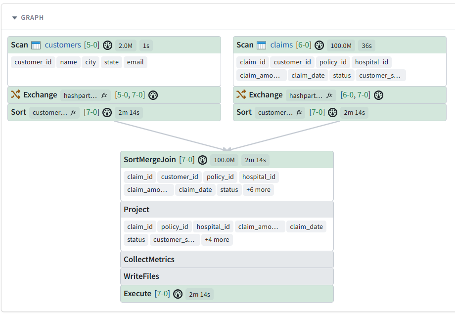<br>

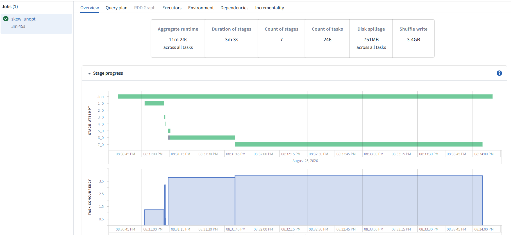<br>

**Problem -**
- One `customer_id` value dominates the dataset, so its partition is far larger than every other partition

**Impact -**
- One task processes the bulk of the data while all other tasks sit idle
- The whole stage waits for that single slow task, stretching runtime dramatically

**After (Option 1), let AQE handle it automatically:**
```python
spark.conf.set("spark.sql.adaptive.enabled", "true")
spark.conf.set("spark.sql.adaptive.skewJoin.enabled", "true")

result = claims_df.join(customers_df, "customer_id", "inner")
```
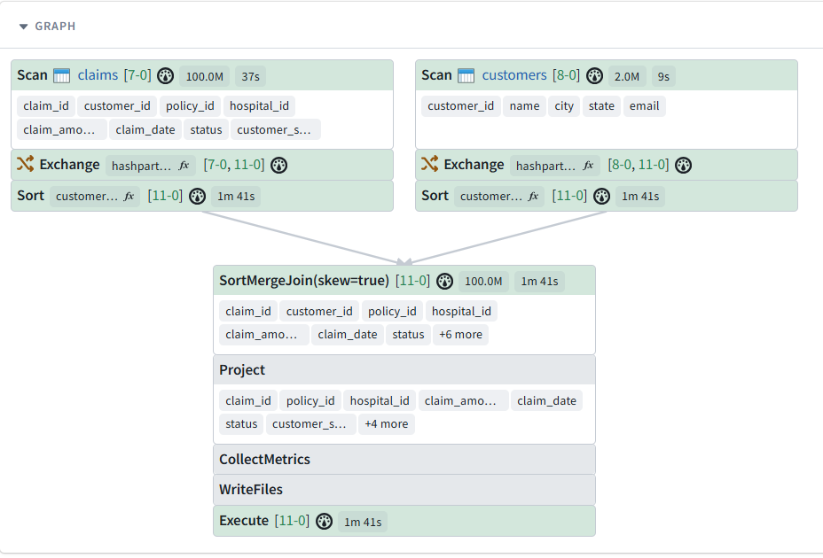<br>

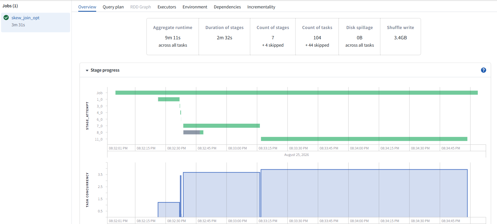<br>

AQE automatically detects skewed partitions at runtime and splits them into smaller, evenly-sized pieces before the join executes - spreading the hot key's workload across multiple tasks instead of overloading one, which reduces the overall build time.

**After (Option 2), manual salting:**
```python
from pyspark.sql.functions import rand, floor, concat, lit, explode, array

NUM_SALTS = 10

# Spread the hot key across multiple sub-keys on the large side
claims_salted = claims_df.withColumn(
    "customer_salt",
    concat(col("customer_id"), lit("_"), floor(rand() * NUM_SALTS))
)

# Explode the small side so every salt bucket has a match
customers_salted = (
    customers_df
    .withColumn("salt_val", explode(array([lit(i) for i in range(NUM_SALTS)])))
    .withColumn("customer_salt", concat(col("customer_id"), lit("_"), col("salt_val")))
)

joined = claims_salted.join(customers_salted, "customer_salt", "inner")

# Drop the salt columns so the output matches the original join exactly -
# same rows, same schema, just computed without the single hot task
result = joined.drop("customer_salt", "salt_val")
```

**Benefits -**
- Work for the hot key (C001) is spread across multiple tasks instead of one
- Stage completion time is driven by average load, not by the single worst partition
- Other tasks no longer sit idle waiting on the skewed one

> **Pro Tip:** *Try AQE's skew join handling first on Spark 3.x+ - it often fixes this with zero code changes. Fall back to manual salting only if AQE isn't available or doesn't fully resolve it.*

## 6. Partition for the Next Expensive Operation
Repartitioning isn't inherently an optimization. It only helps when the partitioning you create benefits an expensive operation that follows. The key is to "look to the right" in the pipeline: before repartitioning, ask what the next join, aggregation, window, or other shuffle-heavy operation needs.

Repartitioning on a key that helps one operation but immediately becomes irrelevant to the next operation simply adds another shuffle later. The goal isn't to pick one partition key and carry it throughout the pipeline - it's to partition strategically based on what comes next.

### Example

**Before, repartitioning without looking ahead:**
```python
# Repartitioned by policy_id "to help the join"...
claims_df = claims_df.repartition("policy_id")

policies_df = policies_df.drop(F.col("customer_id"))
claims_joined = claims_df.join(policies_df, "policy_id")

# ...but BOTH window functions immediately after need customer_id partitioning,
# which doesn't match what we just shuffled for
w_amount = Window.partitionBy("customer_id").orderBy(F.col("claim_amount").desc())
w_date   = Window.partitionBy("customer_id").orderBy("claim_date")

ranked    = claims_joined.withColumn("amount_rank", F.rank().over(w_amount))
sequenced = ranked.withColumn("claim_seq", F.row_number().over(w_date))
```

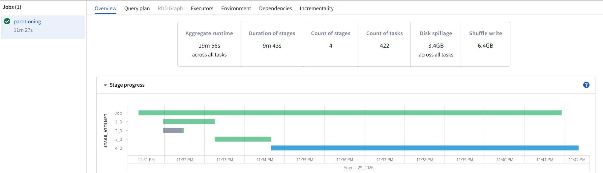<br>

**Problem -**
- Data is shuffled by `policy_id` even though that partitioning does not help the next operation
- The window requires data to be partitioned by `customer_id`, triggering another shuffle
- The original repartition effectively gets discarded as soon as the window needs a different distribution

**Impact -**
- Two expensive shuffles where one may have been sufficient
- Additional network I/O and serialization
- More intermediate data movement and longer stage execution time

**After, partition for what comes next:**
```python
# Repartitioned by policy_id "to help the join"...
claims_df = claims_df.repartition("policy_id")
policies_df = policies_df.drop(F.col("customer_id"))
claims_joined = claims_df.join(policies_df, "policy_id")

# Repartition ONCE, on the key that serves BOTH upcoming window functions
claims_repartitioned = claims_joined.repartition("customer_id")

w_amount = Window.partitionBy("customer_id").orderBy(F.col("claim_amount").desc())
w_date   = Window.partitionBy("customer_id").orderBy("claim_date")

ranked    = claims_repartitioned.withColumn("amount_rank", F.rank().over(w_amount))
sequenced = ranked.withColumn("claim_seq", F.row_number().over(w_date))
```
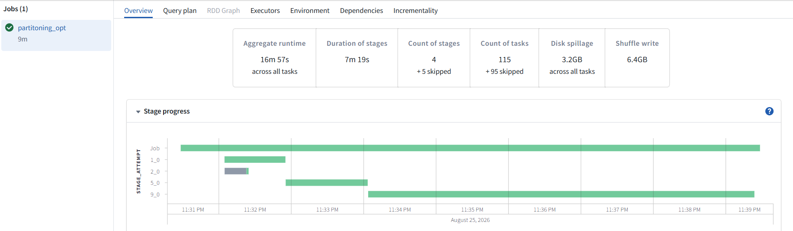<br>

**Benefits -**
- The manual repartition directly supports the next expensive operation
- Avoids paying for an early shuffle whose partitioning is immediately invalidated
- Makes partitioning decisions based on the actual downstream workload rather than applying one partition key across the entire pipeline

### When you need fewer partitions, use coalesce()
Sometimes the issue isn't the partitioning key - you simply have more partitions than you need after filtering or reducing the dataset.

```python
filtered = ranked.filter(col("claim_rank") == 1)

# Avoid a full shuffle just to reduce partition count
filtered = filtered.coalesce(4)

filtered.write.mode("overwrite").parquet("output_path")
```

`repartition()` performs a shuffle and is appropriate when you need to change the distribution or increase/rebalance partitions. `coalesce()` can reduce the number of partitions without a full shuffle and is often the better choice when you're simply shrinking the partition count.

> **Pro Tip:** *Look to the right. Before repartitioning, identify the next expensive operation and the distribution it needs. Don't carry a partitioning strategy through the pipeline just because it was useful earlier.*

## 7. Never collect() Large Results
`collect()` pulls all the data from across the cluster back onto a single machine - the driver. This works fine for small results, but pulling millions of rows onto one machine will exhaust its memory and crash the job.

The driver typically has far less memory available than the combined memory of all your executors. Asking it to hold everything defeats the whole purpose of distributed computing.

### Example

**Before, pulling the full dataset onto the driver:**
```python
# Pulls every row back to a single machine - crashes for a large claims_df
all_claims = claims_df.collect()
for row in all_claims:
    process(row)
```

**Problem -**
- All of `claims_df` gets copied onto the driver, no matter how large it is (15 rows here, millions in production)

**Impact -**
- Driver runs out of memory and crashes, often with no obvious link back to `collect()`
- Loses the benefit of distributed processing entirely

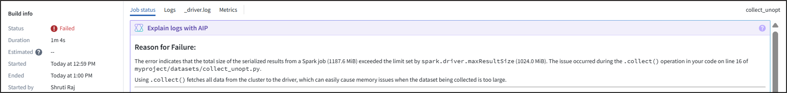<br>

**After, keep the data distributed, flow it to a sink:**
```python
# Use spark native function to collect results - collect_set/collect_list
claims_df.groupBy("claim_id").agg(collect_set("claim_category"))

# If you genuinely need a small, bounded sample - limit() first, then collect
sample_rows = claims_df.limit(100).collect()
```

**Benefits -**
- Using spark native function to collect results ensures parallelized processing and not overloading the Driver
- `limit()` before `collect()` gives a safe way to sample data

> **Pro Tip:** *Think of the driver as a coordinator, not a worker. Data should stay distributed and flow to a sink - it shouldn't round-trip through a single machine unless it's genuinely small and bounded.*

## 8. Caching & Persisting
Caching keeps data in memory, so you don't have to recompute it every time you use it - great when you reuse the same DataFrame multiple times. But if you never release that memory (`unpersist()`), it sits there indefinitely, crowding out memory that later stages need for their own work.

Cached data occupies "storage memory" in each executor. If it's never released, there's less memory available for the "execution memory" that joins, sorts, and aggregations need - increasing the chance those operations spill to disk and slow down.

### Example

**Before:**
```python
enriched = (
    claims_df
        .join(policies_df, "policy_id")
        .join(customers_df, "customer_id")
        .filter(F.col("claim_amount").isNotNull())
)

# Each of these triggers the FULL join chain above from scratch -
# Spark has no memory of the previous run's shuffle output
by_customer = enriched.groupBy("customer_id").agg(
    F.sum("claim_amount").alias("total_claims"),
    F.count("*").alias("claim_count")
)
by_cust.write_dataframe(by_customer)

by_hospital = enriched.groupBy("hospital_id").agg(
    F.sum("claim_amount").alias("hospital_claims")
)
by_hosp.write_dataframe(by_hospital)

by_state = enriched.groupBy("customer_state").agg(
    F.avg("claim_amount").alias("avg_claim_amount")
)
by_st.write_dataframe(by_state)
```
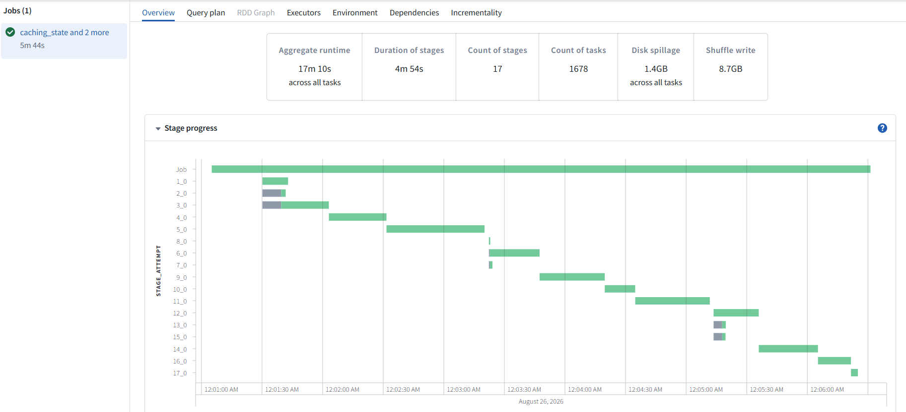<br>

**Problem -**
- `claims_df` (and whatever transformation chain built it) is recomputed from scratch for every downstream action that uses it
- Spark has no memory of the earlier work - each `groupBy` triggers its own full read/transform pass
- Multiple stages and disk spillage

**Impact -**
- The same expensive upstream computation (joins, filters, salting, etc.) runs twice, tripling cost if reused a third time
- Runtime grows linearly with the number of reuses instead of staying flat

**After, persist once, reuse, then release:**
```python
from pyspark import StorageLevel

enriched = (
    claims_df
    .join(policies_df, "policy_id")
    .join(customers_df, "customer_id")
    .filter(F.col("claim_amount").isNotNull())
    .persist(StorageLevel.MEMORY_AND_DISK)
)

enriched.count()  # force materialization ONCE - this is the only time the join chain runs

by_customer = enriched.groupBy("customer_id").agg(
    F.sum("claim_amount").alias("total_claims"),
    F.count("*").alias("claim_count")
)
by_cust.write_dataframe(by_customer)

by_hospital = enriched.groupBy("hospital_id").agg(
    F.sum("claim_amount").alias("hospital_claims")
)
by_hosp.write_dataframe(by_hospital)

by_state = enriched.groupBy("customer_state").agg(
    F.avg("claim_amount").alias("avg_claim_amount")
)
by_st.write_dataframe(by_state)

# Release the memory immediately - we're done reusing "enriched" past this point
enriched.unpersist()
```

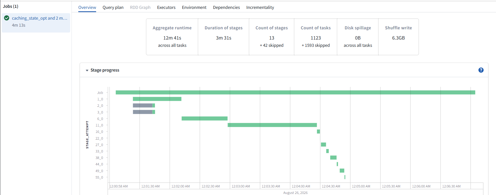<br>

**Benefits -**
- The expensive upstream chain runs once, no matter how many times `enriched` is reused afterward
- `unpersist()` frees storage memory immediately, leaving more room for execution memory in later stages
- Reduces the risk of spills during joins/sorts/aggregations that come after this point in the pipeline

**Storage levels available in `persist()`:**
- **MEMORY_ONLY:** Stores data in memory (fastest). Recomputed if it doesn't fit (no disk fallback).
- **MEMORY_AND_DISK:** Stores in memory, spills excess to disk. Balanced performance and reliability.
- **MEMORY_ONLY_SER:** Serialized in memory (less space, slower due to deserialization).
- **MEMORY_AND_DISK_SER:** Serialized in memory + disk fallback. Saves memory with moderate performance.
- **DISK_ONLY:** Stores only on disk. Most reliable, slowest access.

> **Pro Tip:** *When you cache something, mentally mark the point where you're done with it - and call unpersist() right there, not at the end of the script (or never, which is what usually happens by accident).*

## 9. Minimize Materialization & Execution-Boundary Changes
Every time you write data to disk and then read it back in the middle of a pipeline, you create a hard stop that Spark's optimizer can't see across. You also pay real disk I/O costs that add up fast - disk and network operations are dramatically slower than staying in memory.

Catalyst works by looking at your entire chain of transformations and finding the most efficient way to execute all of it together. Once you write to disk and read it back, that chain is broken into two separate plans that can't be optimized jointly.

### Example

**Before, unnecessary intermediate write breaks the plan in two:**
```python
claims_df.filter(col("claim_amount").isNotNull()) \
    .write.mode("overwrite").parquet("/tmp/staging/claims_filtered")

# Reading it back forces a brand-new, disconnected execution plan
staged_df = spark.read.parquet("/tmp/staging/claims_filtered")
result = staged_df.join(customers_df, "customer_id")
```

**Problem -**
- The write and subsequent read split what could be one logical plan into two separate, disconnected plans
- Catalyst optimizes each plan in isolation - it never sees the filter and the join as part of the same chain

**Impact -**
- Disk I/O cost is paid twice - once to write the intermediate data, once to read it back
- Catalyst can't optimize across the write boundary, so cross-step optimizations (like pushing the filter further down or choosing a join strategy based on filtered size) are lost
- The extra disk round-trip plus the missed optimizations combine to slow down end-to-end runtime

**After, one continuous pipeline, optimized as a whole:**
```python
result = (
    claims_df
    .filter(col("claim_amount").isNotNull())
    .join(customers_df, "customer_id")
)
```

**Benefits -**
- Catalyst sees the filter and join as one unit and can optimize them jointly (e.g., pushing the filter into the scan, choosing the best join strategy based on real filtered size)
- No intermediate disk write/read round-trip, saving real I/O time
- Fewer moving parts in the pipeline - one plan instead of two disconnected ones to reason about and debug

> **Rule of thumb:** *Let Spark see the whole pipeline before it must hit disk. Only materialize intermediate results when you genuinely need to (checkpointing for fault tolerance, sharing across separate jobs) - not as a default habit.*

## 10. Avoid Unnecessary Global Sorts & Repeated Calculations
Sorting your entire dataset (`orderBy`) requires a full shuffle to get everything in the right order across the cluster - it's one of the most expensive things you can ask Spark to do. Doing this more than once or recalculating the same derived column or window function in multiple places means paying that cost repeatedly for no added benefit.

Spark doesn't automatically notice that two separately written expressions are computing the exact same thing - it will happily redo the same expensive work if you write it twice, even if the result would be identical.

### Example

**Before, sorted too early, window function computed twice:**
```python
from pyspark.sql import Window
from pyspark.sql.functions import rank

w = Window.partitionBy("customer_id").orderBy(col("claim_amount").desc())

# Global sort run early, before filtering has even shrunk the data
sorted_df = claims_df.orderBy("claim_amount")

# Same window function recomputed independently in two branches
high_value = sorted_df.withColumn("rank", rank().over(w)).filter(col("rank") == 1)
claims_per_customer = sorted_df.withColumn("rank", rank().over(w)).groupBy("customer_id").count()
```

**Problem -**
- A full global sort runs before the data has even been trimmed down
- The same window function is written twice and computed twice, once per branch

**Impact -**
- Extra full-shuffle sorts that aren't needed this early in the pipeline
- The expensive window computation runs twice for identical results; Spark has no idea the two are the same

**After, compute once, reuse, sort last:**
```python
w = Window.partitionBy("customer_id").orderBy(col("claim_amount").desc())

# Compute the window function once, reuse the result across branches
ranked_df = claims_df.withColumn("rank", rank().over(w)).cache()

high_value = ranked_df.filter(col("rank") == 1)
claims_per_customer = ranked_df.groupBy("customer_id").count()

# Global sort applied once, at the very end, only on the final output
final_output = high_value.orderBy(col("claim_amount").desc())

ranked_df.unpersist()
```

**Benefits -**
- Window function runs once instead of twice - same result, half the compute
- Global sort happens only once, on the smaller final output instead of the full dataset
- Fewer shuffles overall, leading to a faster pipeline

> **Pro Tip:** *Compute shared logic once and reuse the result across branches. Save global sorting for the very end of the pipeline, and only when the final output genuinely requires strict ordering.*


## Summary

**Quick Reference:**

| S.No. | Anti-pattern | Fix | Spark mechanism |
|--------|-------------|-----|-----------------|
| 1 | Filter/select after join | Filter/select before join | Predicate & column pushdown |
| 2 | `crossJoin` + filter | `join()` with a real key | Sort-merge / hash join |
| 3 | Aggregate after join | Aggregate before join | Shrinks join input size |
| 3b | Deduplicate after join (dimension-side duplicates fan out) | Deduplicate before join | Prevents row fan-out / shuffle bloat |
| 4 | Small/static dimension tables joined via sort-merge (shuffle) instead of broadcast | Explicitly `broadcast()` genuinely small tables; don't force it on unverified/large ones; trust AQE when unsure | Broadcast hash join (skips shuffle) |
| 5 | Skewed key → one slow task | Salting / AQE skew handling | Partition rebalancing |
| 6 | Repartitioned on a key the next operation doesn't need - "look to the right" before repartitioning | Repartition on the key the next expensive operation actually needs | Avoids a redundant, invalidated shuffle |
| 6b | Using `repartition()` just to reduce partition count | Use `coalesce()` instead | Reduces partitions without a full shuffle |
| 7 | `collect()` on large data | Write to sink / `limit()` | Driver memory limits |
| 8 | `cache()` never released | `unpersist()` right after last use | Storage vs. execution memory |
| 9 | Intermediate disk read/write | Keep pipeline as one continuous plan | Catalyst whole-plan optimization |
| 10 | Repeated sort/window calc | Compute once, sort last | Avoid redundant shuffle and recompute |

Spark performance is ultimately about doing less work, moving less data, and using resources wisely. The best optimizations often come from simple choices: filter early, join intelligently, avoid unnecessary shuffles, keep data distributed, and let Catalyst and AQE do what they do best. Write Spark code with the execution plan in mind, not just the result.