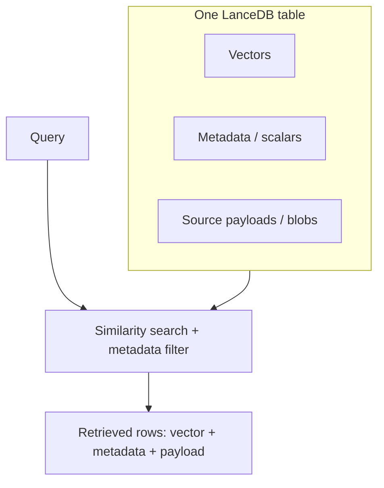
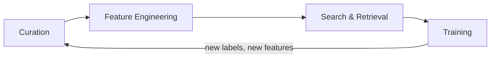
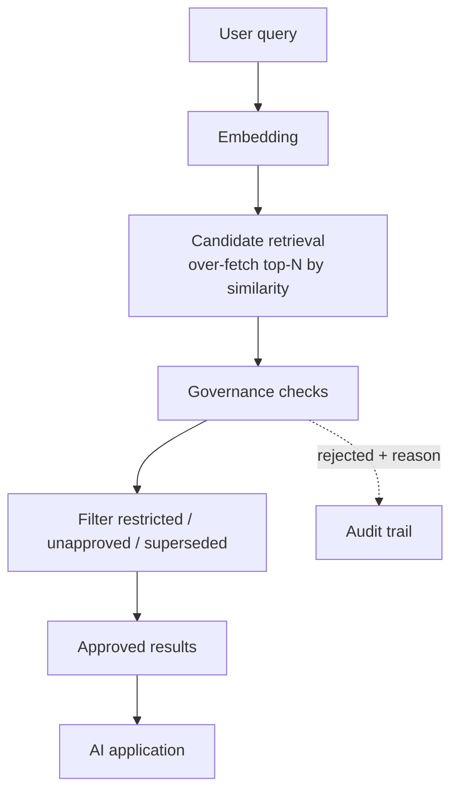

# LanceDB: Semantic Search for AI Applications
## Contributors
[Anshita Garg](https://github.com/AnshitaGarg), [Linkedin](https://www.linkedin.com/in/anshita-garg-8286a5231/)

[Yogesh Raja](https://github.com/yogesh01712), [Linkedin](https://www.linkedin.com/in/yogesh1712/)

[Anudeep Chatradi](https://github.com/anudeepchatradi), [Linkedin](https://www.linkedin.com/in/anudeep-chatradi-78757298/)

[Abhishek Chaudhary](https://github.com/achaudhury7378), [Linkedin](https://www.linkedin.com/in/abhishek-chaudhury-07422b191/)

## Overview

LanceDB is an embedded vector database. It runs inside your process the way SQLite does, not as a server you connect to over the network. You point it at a directory (local disk or object storage), and it reads and writes tables in a columnar format called Lance. There's no cluster to operate for the basic case, which is why it shows up so often in notebooks and prototypes before it shows up in production.

The reason a vector database exists at all comes down to how modern AI represents meaning. An embedding model takes a piece of content — a paragraph, an image, an audio clip — and maps it to a vector of floating-point numbers. Content that means similar things lands close together in that vector space. The nearest-neighbour lookup is the core operation a vector database is built to make fast. In a retrieval-augmented generation (RAG) system, the quality of the answer is bounded by the quality of what you retrieved.

Here's the shape of a typical pipeline:

```text
Data → Embedding Generation → LanceDB → Similarity Search → Retrieved Context → LLM / Application
```

What distinguishes LanceDB from a bare vector database is that a vector isn't stored as an isolated artifact. A row holds the vector *and* everything attached to it: the original text or a pointer to the source payload, plus metadata like an owner, a classification, a version, timestamps. When you search, you get the whole row back, not just an ID you then have to join against three other systems.

The Lance columnar format is the reason LanceDB can do fast point lookups on individual rows rather than the full-file scans that classic columnar formats are tuned for. More on that ahead.

## LanceDB: The Multimodal AI Lakehouse

A *lakehouse* is a table format plus management semantics — schema, versioning, transactional commits — sitting directly on cheap object storage, queryable without loading everything into a separate warehouse. Iceberg, Delta, and Hudi popularised this for analytics. LanceDB brings the same idea (tables on object storage, versioned, self-describing) but tunes it for a different workload. AI retrieval optimises for grabbing a handful of specific rows fast, and for storing things analytics formats never had to: dense vectors, and large binary payloads like images and audio.

That's the *multimodal* feature of LanceDB. Lance can hold scalars, vectors, and blobs in the same table, so an image, its caption, its embedding, and its labels can be one row. You don't end up with vectors in one service, thumbnails in a bucket, and metadata in Postgres, wired together with brittle sync jobs. Keeping them together removes a whole class of consistency bugs — the ones where your vector index says a record exists but the metadata store disagrees because one write succeeded and the other didn't.




## Lance Format


Traditional analytical formats like Parquet are built to scan. Data is grouped into large row groups, columns are encoded and compressed in big blocks, and reading is efficient when you sweep across many rows and aggregate. Ask Parquet for "rows 5, 900, and 12,004 specifically," though, and it has to locate and decode whole blocks to hand you three rows. Point lookups are its weak spot. Retrieving a few specific rows requires locating and decoding larger blocks, making point lookups expensive.

Vector search is all about point lookups. The index narrows a query to a small set of candidate row positions, and then you need those exact rows, quickly. Model training has the same appetite from a different angle — shuffling means reading rows in random order every epoch. Both want cheap random access, which is precisely what scan-oriented formats deprioritise.

Lance is a columnar format designed around that need. Its layout lets you read row *N* without decoding an entire row group, so fetching scattered individual rows is a first-class operation instead of an accident you pay for. It keeps columnar's advantages for scans while making random access affordable.

### Capabilities of Lance Format

| Capability | Why it matters for AI workloads |
|---|---|
| Columnar storage | Read only the columns a query needs; keep good compression and scan performance for feature extraction and analytics over the same data. |
| Fast random access | Fetch the specific rows an ANN search identified, and support random-order reads for training — the patterns scan-optimised formats handle poorly. |
| Native vector column | Store fixed-length embedding vectors as a typed column alongside everything else, so search and metadata live in one place. |
| Multimodal payloads | Hold large binaries (images, audio, documents) in the same table as vectors and scalars, with lazy access so a metadata-only scan doesn't pay to read blobs. |
| Row-level update / delete | Change or remove individual rows without rewriting the whole table (deletion files + later compaction), enabling corrections and record removal. |
| Zero-copy versioning | Every write is a new version you can read, roll back to, or clean up — reproducibility and safe recovery without external backups. |
| Schema evolution | Add a column by writing only that column's data, not by rewriting existing columns — cheap enrichment as your feature set grows. |

I'm only listing capabilities the format actually provides. Two of them — versioning and compaction — are worth seeing in code.

### Why Lance?

Storage formats often become bottlenecks in AI workloads because their access patterns differ from traditional analytics.

AI workloads rely heavily on point lookups, discussed above. Vector search narrows a query to a small set of candidate rows and needs those exact rows quickly. Model training also involves random row access due to shuffling.

Lance is designed around these AI-centric access patterns. It combines columnar efficiency with efficient random access, allowing the same storage layer to support both analytical scans and targeted retrieval.

Its versioned architecture also makes data changes traceable and reproducible, allowing applications to work with consistent dataset versions and recover from unintended changes. Older versions can be retained for time travel and rollback, enabling reproducibility by pinning the exact dataset behind a result and recovering from bad writes.

### Versioning in practice

Every write commits a new version, and unchanged data files are shared across versions, so time travel and rollback are cheap. The example below is verified against LanceDB 0.36.0.

```python
from datetime import timedelta

# History accumulates one version per write:
#   create → v1,  add → v2,  update → v3,  delete → v4

tbl.list_versions()       # enumerate versions
# → [{'version': 1, 'timestamp': ..., 'metadata': {'total_rows': '2', ...}}, ...]

tbl.checkout(version=2)    # time travel: read the table as of v2 (READ-ONLY while checked out)
tbl.checkout_latest()      # return to the writable current tip

tbl.restore(version=2)     # rollback: make v2's state the new tip — kept as a NEW version

tbl.optimize(              # compaction + prune old versions
    cleanup_older_than=timedelta(days=7),
    delete_unverified=False,
)
```

A few things that matter in practice:

- `version` starts at 1 and increments on every `add` / `update` / `delete` / index build.
- While checked out to an old version the table is read-only — a write raises `ValueError`. Call `checkout_latest()` (or `restore`) first.
- `restore` doesn't erase later versions; it appends a new one holding the old state, so the rollback itself stays in the history.
- `cleanup_old_versions()` is deprecated (since 0.21) and requires `pylance` — use `tbl.optimize(cleanup_older_than=...)` instead. It both compacts fragments and prunes versions older than the cutoff.


## CocoIndex: Engine behind fast Retrieval

Once a corpus stops being static, a new problem shows up: keeping the index fresh without redoing everything.

The naive approach is a full refresh. Source changes, so you reprocess the whole dataset, re-embed every record, and rebuild the table:

```text
Full refresh
  Source data
      ↓
  Reprocess everything
      ↓
  Generate embeddings again
      ↓
  Rebuild vector database
```

Embedding is an expensive step, so re-embedding thousands of unchanged records because ten of them changed is pure waste. CocoIndex is a data transformation framework that takes over that bookkeeping. Unchanged inputs are served from cache. LanceDB is one of its built-in targets, which is why it's relevant here.

```text
Incremental processing
  Source data
      ↓
  Detect changes
      ↓
  Process changed records only
      ↓
  Update LanceDB (upsert / delete by key)
```

Here's the LanceDB-facing end of a CocoIndex flow:

```python
import os
import cocoindex.targets.lancedb as coco_lancedb

my_pipeline_output.export(
    "product_embeddings",
    coco_lancedb.LanceDB(
        db_uri=os.environ.get("LANCEDB_URI", "./lancedb_data"),
        table_name="product_catalog",
        num_transactions_before_optimize=10,
    ),
    primary_key_fields=["id"],
)
```


- `my_pipeline_output` is a collector — the set of rows the flow has assembled (each row here being something like a product's id, its fields, and its embedding). `.export(...)` is what writes that collection to a target.

- `"product_embeddings"` names this export within the flow.

- `coco_lancedb.LanceDB(...)` configures the LanceDB target. `db_uri` is where the database lives, defaulting to a local `./lancedb_data` folder but overridable by an environment variable — the usual pattern for pointing at object storage in a deployed setting. `table_name` is the destination table.

- `num_transactions_before_optimize=10` controls maintenance: after roughly ten write transactions, run an optimize/compaction pass. This matters because incremental writes create many small commits over time, and compaction consolidates them so reads don't degrade.

- `primary_key_fields=["id"]` is the important line. It tells the target how to identify a row. That key is what makes incremental behaviour possible: when a product with a given `id` changes, CocoIndex knows to *upsert* that row rather than append a duplicate, and when a source record disappears, it knows which target row to delete.

## Build Better Models; Faster

The engineering argument for co-locating AI data is about friction, not magic. Nothing about a storage layout makes a model more accurate on its own, and I want to be careful not to imply otherwise. What it changes is how much plumbing sits between an idea and an experiment.

Think about the lifecycle:



Raw data gets curated. Features and embeddings get derived from it. You search and retrieve to build evaluation sets, find hard examples, or assemble training batches. You train, discover something, and loop back to curate more. When raw data, metadata, embeddings, features, and governance flags each live in a different system, every hop in that loop is an export, a join, a sync, and a chance for the copies to drift. The overhead isn't dramatic on any single step; it accumulates across dozens of iterations until "try a variation" is an afternoon instead of a coffee break.

Where Lance and LanceDB fit is as the shared substrate for that loop. Embeddings sit next to the rows they came from. Adding a new feature column is a cheap schema change rather than a table rebuild. Versioning means an experiment can reference an exact snapshot of the data, so a result is reproducible months later. The honest framing is the modest one: better organisation and access reduce friction in AI experimentation. That's worth a lot, and it's a different claim from "builds better models."

## LanceDB in Palantir Foundry

First, the thing that has to be said plainly: **LanceDB is not a native component of Palantir Foundry.** Foundry does not ship it, and nothing here should be read as "Foundry has a built-in vector database." What Foundry offers is a governed data platform — datasets, Spark-based transforms, an Ontology, and marking-based access control — and LanceDB is an external library you would run inside that environment. The interesting question is where the seam is.

A reasonable conceptual architecture looks like this, with the ownership made explicit:


### The governed retrieval proof of concept

The flow the POC implements:



Each stored chunk carries governance columns alongside its vector: `owner`, `classification`, `version`, a `doc_family` that groups versions of the same logical document, and an `approved_for_ai` flag. Retrieval over-fetches candidates by similarity, then runs each candidate through an ordered set of gates. The gate function is the heart of it:

```python
def evaluate_governance(candidate, max_classification, owner_filter):
    if not candidate["approved_for_ai"]:
        return False, "not approved_for_ai"
    if rank(candidate["classification"]) > rank(max_classification):
        return False, f"classification '{candidate['classification']}' exceeds clearance '{max_classification}'"
    if not candidate["is_latest_version"]:
        return False, f"superseded version {candidate['version']} of '{candidate['doc_family']}'"
    if owner_filter and candidate["owner"] != owner_filter:
        return False, f"owner '{candidate['owner']}' != '{owner_filter}'"
    return True, "approved"
```

What matters in that function isn't cleverness — it's the ordering and the fact that every rejection returns a *reason*. The non-negotiable gate (approved-for-AI) runs first; the optional, request-specific one (owner scope) runs last. Because each candidate is judged rather than silently dropped, the system can report exactly what it filtered and why, which is what makes it auditable.

The retrieval itself is an ordinary LanceDB cosine search over the over-fetched candidates:

```python
raw = (
    tbl.search(query_vector)
       .metric("cosine")
       .limit(top_k * candidate_multiplier)
       .to_pandas()
)
# then: convert distance → similarity, run evaluate_governance on each row,
# keep the approved ones up to top_k, record the rest with their reasons.
```

Running a query for *"how long do we keep customer data?"* against a small corpus (an employee handbook, a security policy, a finance policy, and two versions of a data-retention policy) produced this:

```text
Approved: 3 | Filtered: 1 | latency_ms=39.7
  [0.665] data_retention_v2  v2  CONFIDENTIAL
  [0.266] security_policy     v2  CONFIDENTIAL
  [0.254] employee_handbook   v1  PUBLIC
  FILTERED data_retention_v1  reason: superseded version 1 of 'data_retention_policy'
```

The superseded v1 policy is semantically relevant — it's about data retention — and it still gets filtered, correctly, because a newer version exists. Two more behaviours I checked directly:

- **Clearance.** The same security question returns the confidential security policy at `CONFIDENTIAL` clearance and hides it at `PUBLIC` clearance, with the reason recorded as `classification 'CONFIDENTIAL' exceeds clearance 'PUBLIC'`. Same ranking, different permitted set.
- **Live re-classification.** Revoking `approved_for_ai` on the handbook via an in-place `tbl.update(...)` made it disappear from results on the very next query — no re-embedding, no index rebuild — because Lance supports row-level updates. LanceDB reported the table moving to a new version after the change, which ties back to the versioning the format provides.

## Conclusion

LanceDB provides a practical foundation for building retrieval systems where storage, indexing, versioning, and governance need to work together.

The Lance format addresses this at the storage layer through a columnar representation, versioning, efficient updates, and support for multimodal data. LanceDB builds on that foundation to provide vector search and retrieval without requiring a separate system for every type of AI data.

Conclusively, it is less about replacing traditional data formats and more about providing a storage foundation suited to the access patterns and lifecycle of AI data. LanceDB extends that foundation into a practical retrieval layer, making the combination useful for applications ranging from RAG and semantic search to multimodal AI systems.
